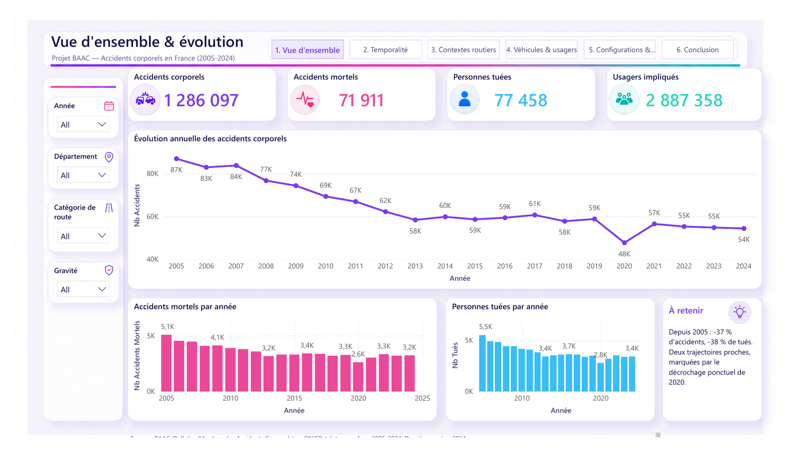
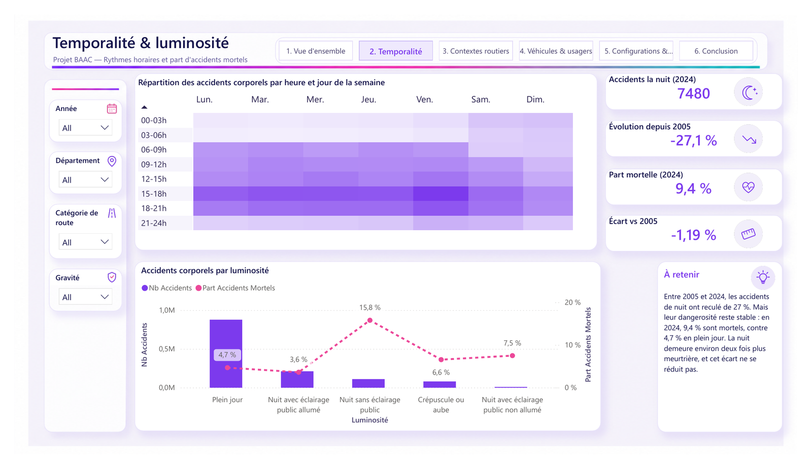
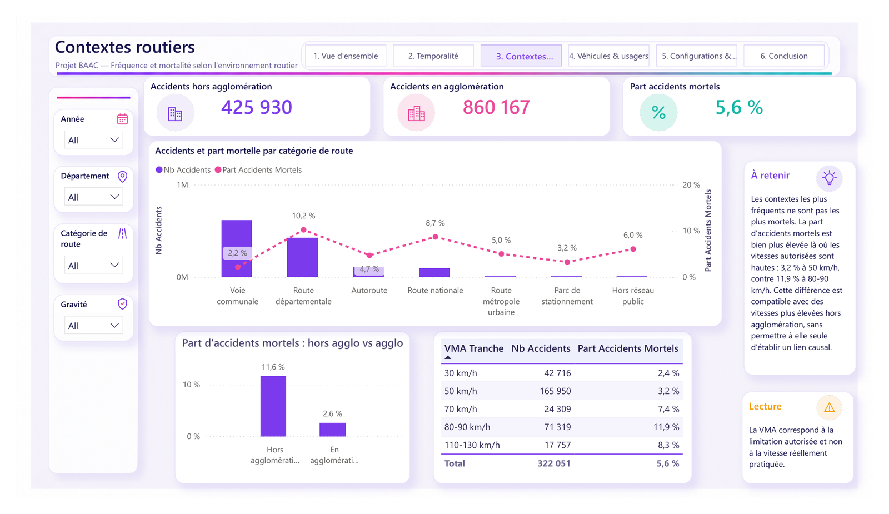
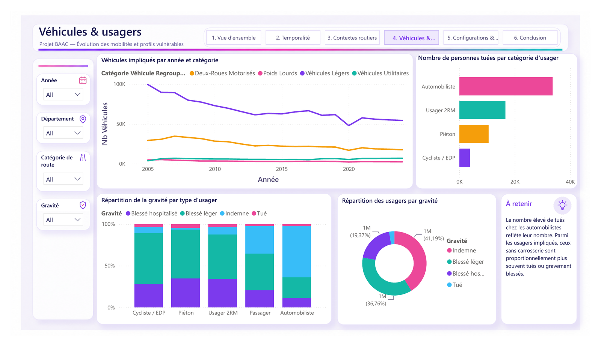
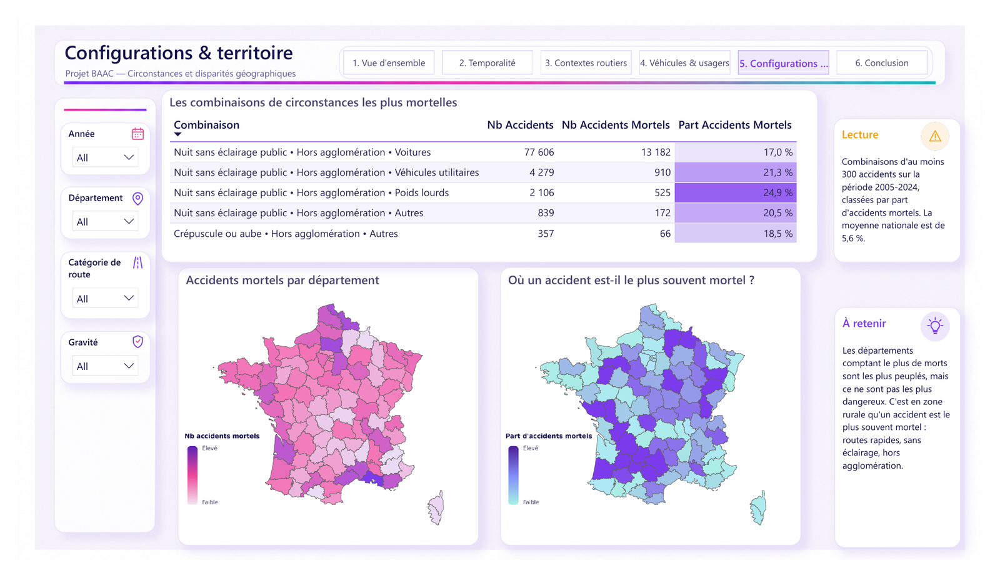
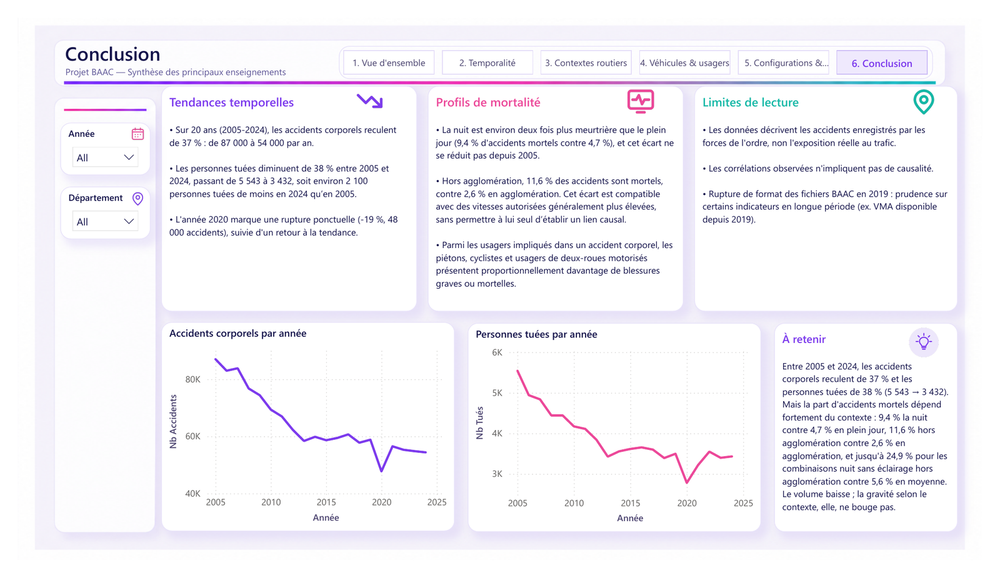

# baac-powerbi-analysis
Analyse des accidents corporels en France (2005-2024) avec Power BI, Power Query et DAX.
Projet d'analyse des accidents corporels de la circulation en France à partir des données ouvertes BAAC / ONISR.

L'objectif est de transformer vingt années de données hétérogènes en un modèle Power BI exploitable, puis d'en tirer une analyse claire des évolutions, des contextes routiers et des profils associés aux accidents les plus graves.

## Chiffres clés

- **20 années de données** : 2005 à 2024
- **1 286 097 accidents corporels**
- **2 887 358 usagers impliqués**
- **4 tables principales** : Caractéristiques, Lieux, Véhicules, Usagers
- **6 pages de dashboard Power BI**

## Outils

- Power BI
- Power Query
- DAX
- Modélisation de données
- Data visualisation
- Data quality

## Travail réalisé

- Import et consolidation de fichiers annuels hétérogènes
- Nettoyage et harmonisation des données avec Power Query
- Contrôle des clés, volumes et relations entre les tables
- Gestion de niveaux de granularité différents : accident, lieu, véhicule et usager
- Création de mesures DAX
- Conception d'un modèle Power BI
- Réalisation d'un dashboard interactif en 6 pages
- Analyse et restitution des principaux résultats

## Principaux axes d'analyse

1. Vue d'ensemble et évolution
2. Temporalité et luminosité
3. Contextes routiers
4. Véhicules et usagers
5. Configurations et territoire
6. Synthèse et limites d'interprétation

## Dashboard

### Vue d'ensemble et évolution

Sur la période **2005–2024**, le jeu de données regroupe **1 286 097 accidents corporels** et **2 887 358 usagers impliqués**.

Le nombre annuel d'accidents passe d'environ **87 000 en 2005 à 54 000 en 2024**, soit une baisse d'environ **37 %**. Sur la même période, le nombre de personnes tuées diminue d'environ **38 %**, de **5 543 à 3 432**.

L'année **2020** constitue une rupture ponctuelle dans la série, avec environ **48 000 accidents**, avant un retour vers la tendance générale.

## Temporalité & luminosité

La répartition heure × jour montre une concentration des accidents en fin d'après-midi en semaine, avec un pic marqué le **vendredi entre 15 h et 18 h**.

Mais le principal enseignement vient de la comparaison entre fréquence et gravité : en **2024**, **9,4 % des accidents de nuit sont mortels**, contre **4,7 % en plein jour**. La nuit reste donc environ deux fois plus meurtrière.

La situation la plus défavorable apparaît la nuit sans éclairage public, avec une part d'accidents mortels qui atteint **15,8 %**.

Ces résultats décrivent des associations observées dans les accidents enregistrés. Ils ne mesurent pas directement le risque individuel de circuler, car les données ne contiennent pas l'exposition au trafic selon l'heure ou la luminosité.

## Contextes routiers

Le volume d'accidents est nettement plus élevé en agglomération : **860 167 accidents**, contre **425 930 hors agglomération**.

Mais la lecture change lorsqu'on regarde la gravité. Hors agglomération, **11,6 % des accidents sont mortels**, contre **2,6 % en agglomération**.

La même différence apparaît selon la vitesse maximale autorisée : la part d'accidents mortels est de **3,2 % à 50 km/h** et atteint **11,9 % pour les tranches 80–90 km/h**.

Ces résultats doivent rester interprétés avec prudence : la VMA correspond à la limitation autorisée et non à la vitesse réellement pratiquée. Les écarts observés sont compatibles avec des contextes routiers plus rapides hors agglomération, sans permettre à eux seuls d'établir un lien causal.

## Véhicules & usagers

Les véhicules légers représentent la majorité des véhicules impliqués, avec une tendance globale à la baisse sur la période. Les deux-roues motorisés constituent la deuxième catégorie la plus visible en volume.

Mais le nombre absolu ne suffit pas pour juger la vulnérabilité. Les automobilistes comptent le plus de personnes tuées en valeur absolue, principalement parce qu'ils sont beaucoup plus nombreux parmi les usagers impliqués.

La lecture proportionnelle montre davantage la vulnérabilité des usagers sans carrosserie : **piétons, cyclistes / EDP et usagers de deux-roues motorisés** présentent plus souvent des blessures graves ou mortelles parmi les personnes impliquées dans un accident.

Tous usagers confondus, environ **41 % sont indemnes** et **37 % blessés légers**. Les catégories les plus graves restent minoritaires, mais elles sont proportionnellement plus présentes chez les usagers vulnérables.

## Configurations & territoire

Cette page croise plusieurs dimensions afin d'identifier les configurations dans lesquelles la part d'accidents mortels est la plus élevée.

Pour éviter de surinterpréter des cas trop rares, seules les combinaisons reposant sur **au moins 300 accidents** sont retenues. La moyenne nationale sur le périmètre présenté est de **5,6 % d'accidents mortels**.

Les configurations les plus défavorables associent principalement la **nuit sans éclairage public** et le **hors agglomération**. Pour les voitures, cette combinaison atteint **17,0 %** d'accidents mortels. Pour les poids lourds, elle monte jusqu'à **24,9 %**, soit près de cinq fois la moyenne nationale.

La lecture territoriale montre également une différence importante entre volume et dangerosité : les départements les plus peuplés concentrent davantage d'accidents mortels en nombre, tandis que plusieurs départements ruraux présentent une part d'accidents mortels plus élevée.

L'objectif est donc de distinguer systématiquement **où il y a le plus d'accidents mortels** et **où un accident est le plus souvent mortel**.

## Conclusion

Sur vingt ans, le constat principal est clair : le volume des accidents diminue fortement, mais la gravité reste très dépendante du contexte.

Entre **2005 et 2024**, le nombre d'accidents corporels baisse d'environ **37 %** et le nombre de personnes tuées d'environ **38 %**.

Mais les écarts de gravité restent marqués :
- **9,4 %** d'accidents mortels la nuit contre **4,7 %** en plein jour ;
- **11,6 %** hors agglomération contre **2,6 %** en agglomération ;
- jusqu'à **24,9 %** pour certaines configurations associant nuit sans éclairage, hors agglomération et catégorie de véhicule, contre **5,6 %** en moyenne.

Le principal enseignement du projet est donc de distinguer systématiquement **le volume d'accidents** de **la part d'accidents mortels**.

### Limites d'interprétation

Les données BAAC décrivent les accidents enregistrés par les forces de l'ordre, mais ne mesurent pas directement l'exposition au trafic.

Les résultats présentés mettent en évidence des associations statistiques et ne permettent pas, à eux seuls, d'établir des relations de causalité.

Enfin, les évolutions de structure des fichiers BAAC, notamment autour de **2019**, imposent une vigilance particulière sur certains indicateurs comparés sur longue période.

## Source des données

Données ouvertes BAAC — Bulletin d'Analyse des Accidents Corporels de la circulation, publiées par l'ONISR sur data.gouv.fr.

## À propos du projet

Ce dépôt présente principalement le travail réalisé sous **Power BI, Power Query et DAX**.

L'objectif du portfolio est de montrer à la fois la préparation des données, la construction du modèle, la création des indicateurs et la restitution visuelle.
